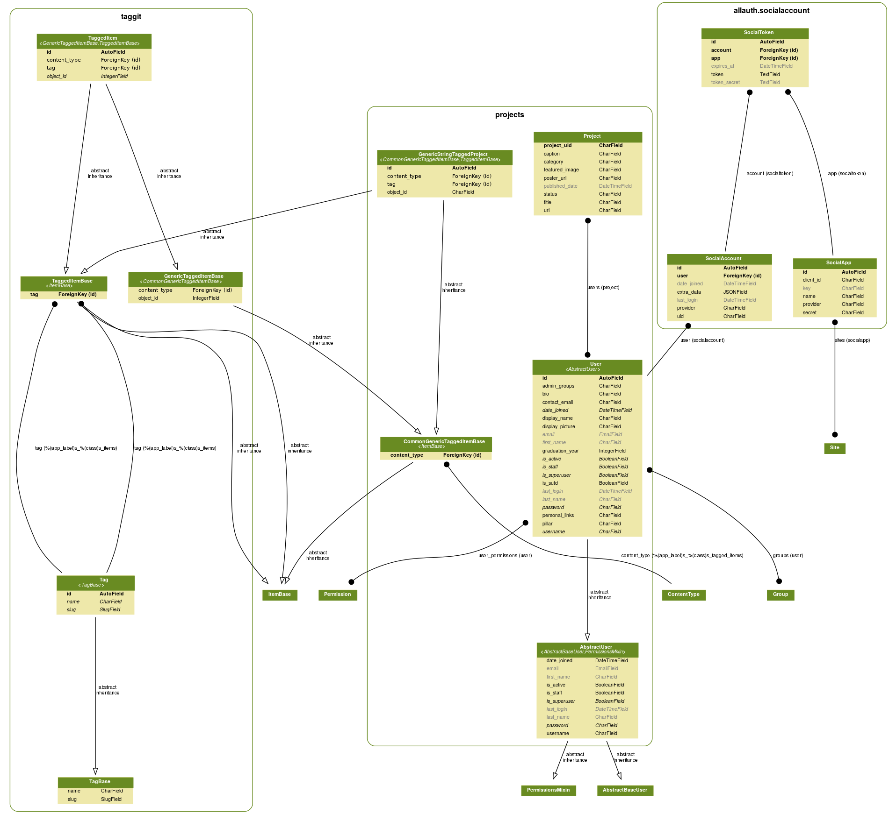

# web-platform-prototype

[](https://app.codacy.com/app/tlkh/web-platform-prototype?utm_source=github.com&utm_medium=referral&utm_content=OpenSUTD/web-platform-prototype&utm_campaign=Badge_Grade_Settings) [](https://travis-ci.org/OpenSUTD/web-platform-prototype) [](https://coveralls.io/github/OpenSUTD/web-platform-prototype?branch=HEAD) 

Prototype for the Eventual OpenSUTD Web Platform

## Database setup

Database will not be pushed to GitHub (will be local on your computer). Use the following script to reset the database.

```
./refresh_db.sh
```

## Running the application server for development

```
# set the GitHub access token for GitHub content integrations
# obtain yours from https://github.com/settings/tokens
# and keep it a secret!!
export GH_ACCESS_TOKEN=XXXXXXX

# make this repo your current directory
cd web-platform-prototype

# to reset the database back to sample values
./refresh_db.sh

# for development without docker
python3 manage.py runserver

# running with docker
# - map port 8000 to port 80
# - mount local folder
TAG=latest-dev
docker run --rm \
 -p 80:8000 \
 --env GH_ACCESS_TOKEN=${GH_ACCESS_TOKEN} \
 -v ${PWD}:/app \
 opensutd/web-platform:${TAG} \
 python3 manage.py runserver 0:8000
```

## Getting GitHub login working

1. Create a GitHub Oauth App (https://github.com/settings/developers)
2. Take note of your client ID and secret keys
3. Go to your running Django instance (e.g. http://localhost:8000)
4. Go to http://localhost:8000/admin and log in with default admin credentials (`superadmin` / `asdf1234`)
5. Add a new **Social Application** and fill in the details from step 2
6. Click save and log out from `superadmin`
7. GitHub Login now works

## Running the built-in tests

```
# make this repo your current directory
cd web-platform-prototype

TAG=latest-dev
docker run --rm \
 --env GH_ACCESS_TOKEN=${GH_ACCESS_TOKEN} \
 -v ${PWD}:/app \
 opensutd/web-platform:latest-dev \
 bash -c './refresh_db.sh &&  python3 manage.py test'
```

### CI Tests

After every commit to the master branch (eg. made via pull request) the following automatic tests will run:

* Travis CI (runs the Django unit test) - look at the `.travis.yml` file
* Snyk vulnerability analysis for Python dependencies
* Codacy code quality check and review
* Coverage report reported via Coveralls.io

## Synchronizing your fork to upstream (OpenSUTD repo)

```
# one time setup
git remote add upstream https://github.com/OpenSUTD/web-platform-prototype

# pull upstream changes
git fetch upstream
git merge upstream/master
git push
```

## Data Model



## Acknowledgements

 [](https://www.python.org/)  
 

